# 

## Introduction
- CalorieCulator is a lifestyle improvement site allowing users to calculate a personalised daily calorie target, apply a range of Macronutrient options, and generate sample meal plans
- The site will initially request the user to input several key measurements (height, weight, age etc) - these measurements will then be used by JavaScript to populate a standard formula (BMR) to calculate and return the user's personalised daily calorie target (PDCT)
- The next step is to ask the user to choose their macronutrient goals from a list of three options - when combined with the calorie output from step 1, this will allow Javascript to calculate a simple personalised protein/carb/fat macronutrient split for the user
- Finally the site will show the user a list of common foods per macronutrient category - the user will select/unselect their preferences & the site will use the list to generate simple meal plan ideas that fit within the user's Calorie & Macro calculations, generating combinations of food options from each category's inventory of foods to provide variety 

## User Experience

### **Strategy**
The site strategy is framed around addressing the user needs below:
- #### User Stories
    - As a user of the site I would like to be able to:
        - Learn about why planning & measuring calorie intake can be beneficial for health
        - Obtain a personalised daily calorie target calculation based on my individual measurements & activity level
        - Receive macro-nutrient mix calculation based on my personalised calorie target above combined with my chosen macro-split option
        - Generate meal plan ideas based on my personal calorie target & macro mix calculations, and my chosen preferred food selections

### **Scope**
Functional Specifications / Content Requirements
- The Scope of the website is informed by the Strategy above, I wanted to ensure the site would have the right scope to actualise the strategy by including content and interactivity that address the user stories
- The site's scope covers some of the benefits of choosing to measure and control caloric intake, set against background images to help a user visually internalise aspects of the activity,as well as three interactive pages to allow the user calculate their calorie targets, macronutrient splits, and meal plans
- I have also demarcated the original possible list of site scope into "existing features" and "features yet to implement" - with the former containing the final features of the live site in the spirit of ensuring a Minimum Viable Product (MVP) that would meet project deadlines

### **Structure**
The site is structured via a 4 page layout, with a header, navigation bar and footer common to all pages, to help the user traverse the site flow. The four pages map as follows:

*1. Home Page:* The site's home page will greet the user with an introduction to the "What", "Why", and "How" of calorie planning & measurement. 

*2. Calorie Calculation Page:* The Calorie Calculation page will take inputs from the user via HTML data entry fields - including the user's gender, height, weight, age & activity level - allowing Javascript to use these inputs as variables in a pre-determined set of formulas, and returning a personalised calorie target for the user. The Harris-Benedict formula is used for the initial Basal Metabolic Rate (hereafter referred to as "BMR") which is then uplifted by an activity factor according to the user's choice (From 1. Sedentary to 5. Very Active)

*3. Macro Mix Page:* The Macro Mix page will ask the user to choose their desired macro-nutrient split (Protein/Carbs/Fats) from three pre-defined options (standard, high-protein, and low-carb) and will then combine this specification with the output from the calorie calculation page, and standard estimated calories per macronutrient per gram to arrive at a personalised daily split in grams per macro-nutrient

*4. Meal Planning Page:* The Meal planning page is the final step in the site flow - and will request the user to select their preferences (or unselect their dislikes) from a pre-determined list of common foods from each of the three macronutrient categories (Protein/Carbohydrates & Fats). 

Completion of this activity will trigger Javascript to build the choices into an array per macro group, and then return one random food choice per macro group within boundaries of: 
- (1) Total daily calories are to equal step 1 output (with a possible small error bar +/- tolerance factor for rounding depending on step 3)
- (2) Daily Calories per individual macro group (Protein/Carb/Fat) are to equal step 2's macro split output (subject to rounding/tolerance)
- (3) There must be one food from each macro group per meal 
- (4) There must be three meals per day (Breakfast, Lunch, Dinner)

The final structural element will enable the user to see a display of the generated sample daily meal plan idea on the page for their personal use

### **Skeleton**
To drive the early site interface & navigvation design efforts, I am using wireframes to map flows across HTML, CSS & Javascript - using a combination of Microsoft Excel & Powerpoint as I have experience with both:
- Microsoft Powerpoint - Primarily for mapping the web page HTML/CSS aspects & structure
- Microsoft Excel - Primarily for mapping logic & formulas in detail for Javascript & showing linkages & integration points between Javascript & HTML/CSS

#### *Site Wireframe - Original Skeleton Concept:*

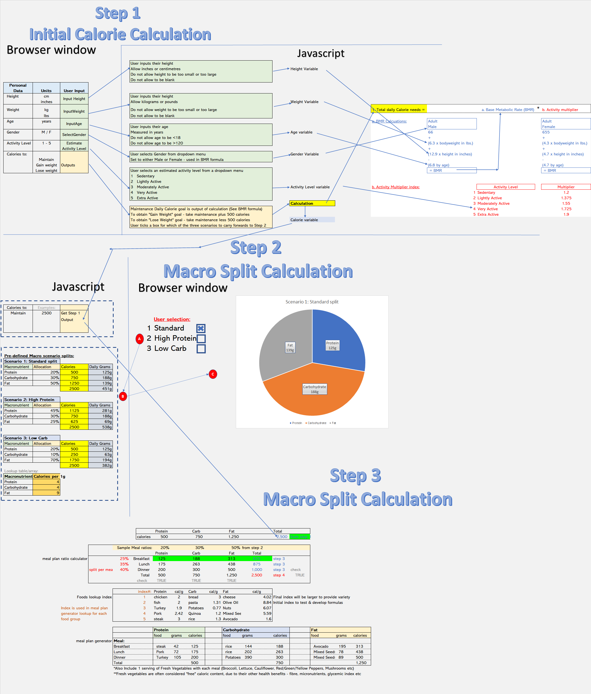

*Home Page:*

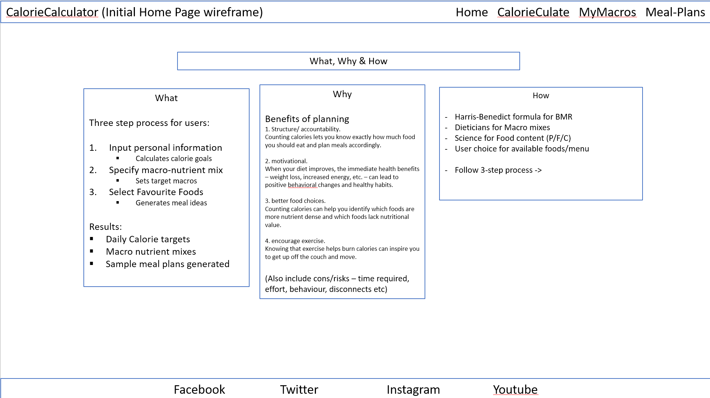

*Calorie Calculation Page:*

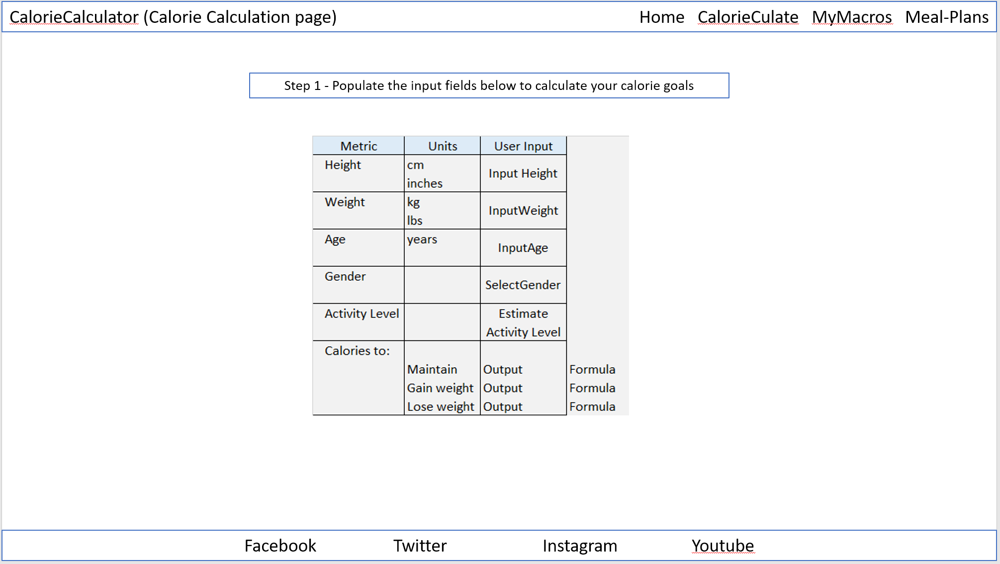

*Macro Mix Page HTML:*

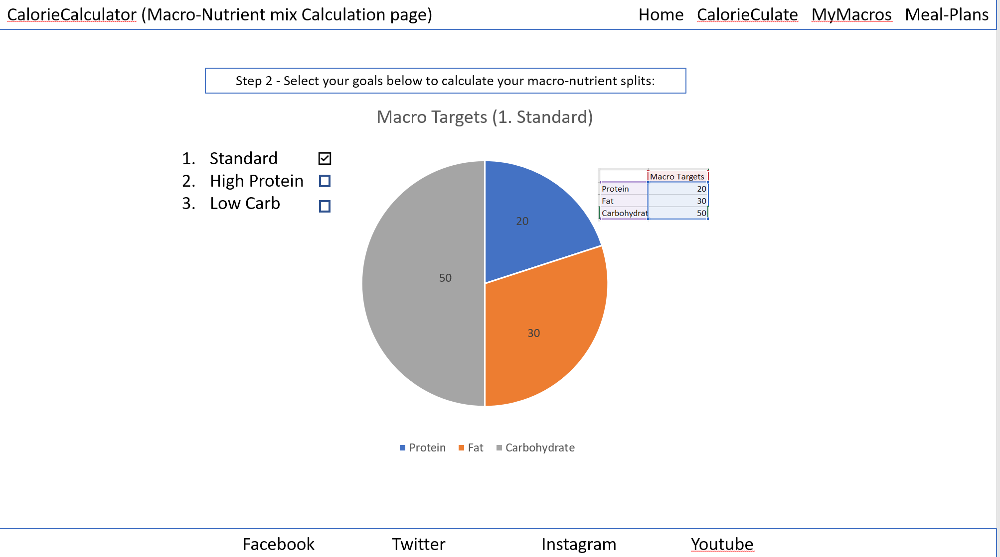

*Meal Planning Page HTML:*

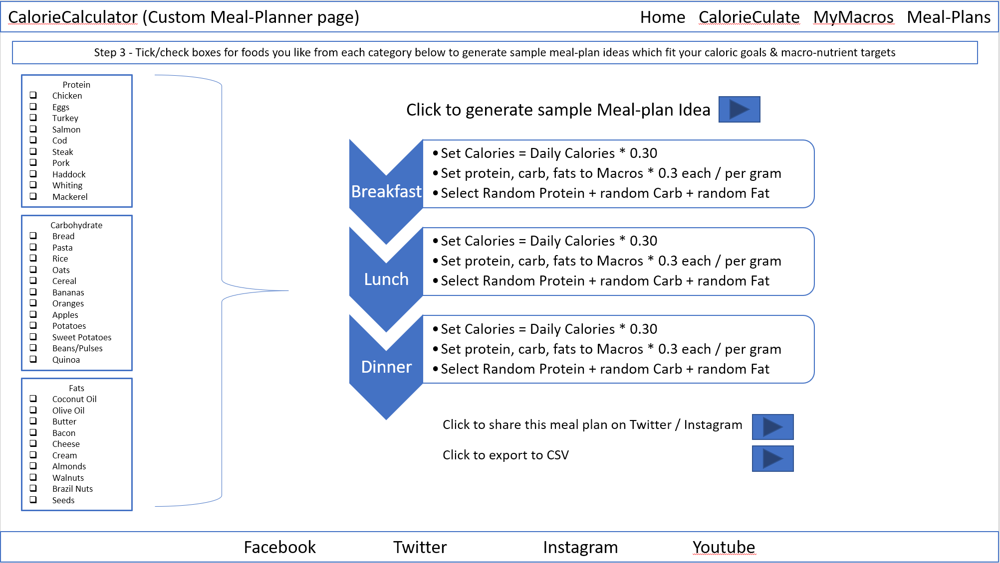

#### *Javascript Skeleton / Formula Mapping:*

An inventory of the formulas required to enable the site strategy are as follows:

A. Calorie Calculation Page
    
    1. Personal Daily Calorie Target (PDCT)

        PDCT = (BMR * Activity Multiplier) * Goal Scenario

    2. Base Metabolic Rate (BMR) 
        
        BMR (Male) = 66 + (6.3 * bodyweight lbs) + (12.9 * height in inches) - (6.8 * age in years)

        BMR (Female) = 655 + (4.3 * bodyweight lbs) + (4.7 * height in inches) - (4.7 * age in years)

    3. Activity Multiplier

        Sedentary = 1.200
        Lightly Active = 1.375
        Moderately Active = 1.550
        Very Active  = 1.725
        Extra Active = 1.900

    4. Goal Scenario

        Maintain Current Weight = 1.0
        Gain Weight = 1.10
        Lose Weight = 0.90

B. Macro Mix Page
    
    5. Option 1: Standard Split

        Protein = PDCT * 20%
        Carbohydrate = PDCT * 50%
        Fat = PDCT * 30%

    6. Option 2: High Protein

        Protein = PDCT * 45%
        Carbohydrate = PDCT * 30%
        Fat = PDCT * 25%

    7. Option 3: High Carbohydrate

        Protein = PDCT * 20%
        Carbohydrate = PDCT * 10%
        Fat = PDCT * 70%

C. Meal Planner Page

    8. Meal Split Ratio - Calories per meal (Static)

        Breakfast = PDCT * 25%
        Lunch = PDCT * 35%
        Dinner = PDCT * 40%

    9. Macros per meal (Dynamic)

        [Meal Split (formula 8)] * [Macronutrient split (from formula 5-7)] in calories per macro per meal
        **Note:** there will be 9x of these calculations - protein, carbs, fat by breakfast, lunch, dinner

    10. Foods Lookup Index (Static)

        Pre-populate with:
        - a fixed index (currently 1 - 5, can be expanded to provide variety)
        - food name (e.g. chicken for protein, rice for carbohydrate, cheese for fat etc)
        - estimated calories per gram (source from internet)

    11. Meal Plan generator

        - An array of (foods) by (meals)
        - Each array element will contain
            - Food name: a random number generated between 1-5 (or length of index in formula 10) and pulled from formula 10's index
            - Meal name: the meal being planned (breakfast, lunch or dinner)
            - Calorie allowance: from formula 9
            - Quantity: of the food (in grams) required to meet the calorie per meal per macro, by dividing formula 9's output by the food's static calories per gram (lookup to formula 10 array)
        - Output will be one food per macronutrient per meal

### **Surface**
The first four Planes of UX enabled the Surface Plane to take shape in terms of finalising the look and feel of the website in terms of color schemes, typography, and imagery:
- #### Color scheme
    - I used the [Coolors](https://coolors.co) color consultation website to generate a [color palette](https://coolors.co/074a88-ffffff-000000) to underpin the content of the site
    - This consists of [Yale Blue](https://coolors.co/074a88-ffffff-000000) (#074A88) and [Black](https://coolors.co/074a88-ffffff-000000) (#000000) backgrounds and highlights behind [White](https://coolors.co/074a88-ffffff-000000) (#FFFFFF) text and borders to ensure sufficient contrast, and that foreground text is never distracted by background imagery

    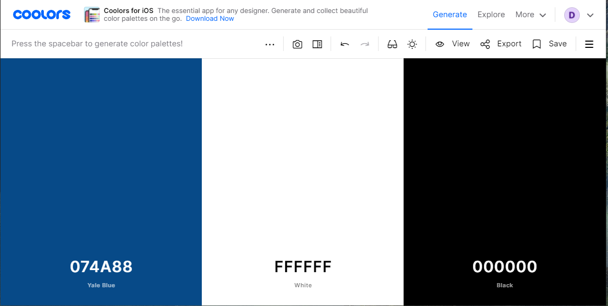
- #### Typography
    - I chose the [Montserrat](https://fonts.google.com/specimen/Montserrat?query=montserrat) font to aid readability & help promote a positive emotional response from the external users of the site.  
    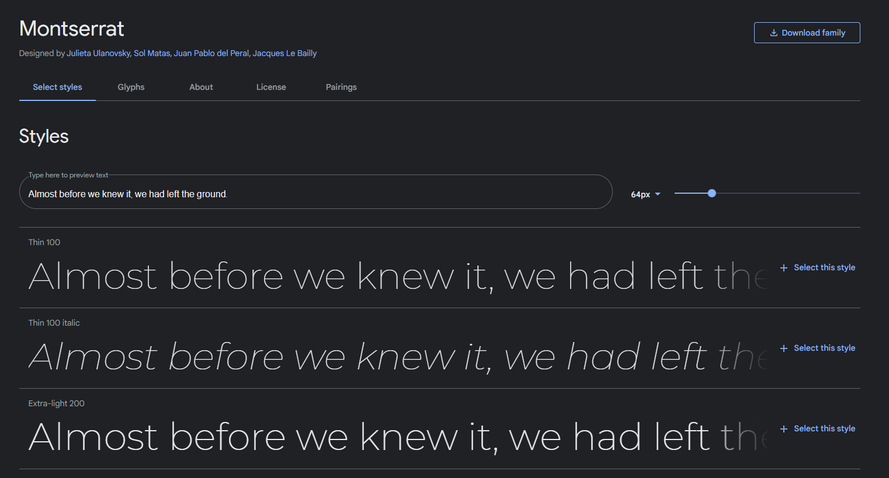

    - I also used [Fontawesome](https://fontawesome.com/) to embed the fire icons,  to help emphasise important elements of the site, and to help with generating a positive emotional response with the site users, and for the favicon image, added to the top of all the site's pages via the head element of the HTML to help with the User Experience & create a professional feel when browsing

- #### Imagery
    - The site is lighter on imagery as it is primarily a calculation engine - however the the hero image is used on all four pages of the site and helps grab the users initial attention before allowing them focus on the content
    - At all times I have ensured that foreground information and content is never distracted by this background imagery by using opacity setting on the color palettes. 
    - The imagery is fully detailed in the Credits section, and is primarily sourced from both [Pexels](pexel.com) and [Pixabay](pixabay.com)
        

## Features
### Existing Features

**Header:** The header is common to all pages, and contains a simple blue border with white borders consistent with the site's design, against which the CalorieCulator logo is set. The header is positioned to remain visible when scrolling down the page on smaller displays.

**Responsive Navigation Bar:** The Nav bar contains links to all four site pages, and contains a highlight to both show the user which page they are currently on, as well as highlighting when the user scrolls over a clickable link. The Nav bar is also fully responsive down to a ultra small screen sizes below 300 pixels in width, and is positioned to disappear off the page when users scroll down, to help maximise screen content on smaller devices

**Footer:** The site footer contains the CalorieCulator logo, as well as clickable links to various external Social Media sites where users can connect. The links will always open in a new tab, and the footer is fully resposive using media queries from large screens down to small mobile devices. It contains a combination of Yale blue and black backgrounds, with white text and borders to ensure high contrast ratios and for consistency with the site's design & color scheme.

**Page Titles:** Each page contains a header, which either welcomes the user (Home Page) or gives the user direction and instruction on the function of the current page (Calorie Calculation, Macro-Mix, and Meal Plan pages). The Site headers are set against a black background, with white text and white borders to ensure a high contrast ratio, promote consistency in the look & feel of the site across pages, and to help avoid the user becoming disorientated as they anvigate the site flow & functionality

**Navigation Buttons:** The site contains three clickable navigation buttons - a "Begin" button on the home page, a "Next Step" button on the MyCalories page, and a "To Final Step" button on the Macro-Mix page. These buttons are features added to aid the user in traversing the site flow, and are formatted with a grey background and black text to differentiate them from the site headers & content to allow easy navigation of the site for the user.

**Calorie Calculation Form:** The Calorie Calculation form takes inputs from the user via HTML data entry fields allowing Javascript to use these inputs as variables in a pre-determined set of formulas, and returning a personalised calorie target for the user. The form is set against a dark background with slight transparency, to ensure foreground text is not distracted by the background imagery, and features three numeric input fields for age, weight & height, as well as two drop down menus for gender and activity level selection. Lastly, the form also contains a calculation button feature, further detailed below

**Calculation Buttons:** The site features four calculation/instruction buttons at various points - each of which trigger Javascript to perform certain tasks & interactivity. 

The Calorie Calculation page contains a "Calculate My PDCT" button - triggering the Javascript PDCT calculation function & output storage via an event listener, programmed on script.js.  

The Macro-mix page contains a "Begin - Import My PDCT" button - triggering Javascript to get the previously calculated PDCT from local storage & display for the user in preparation for the application of the Macronutrient split options to follow

**Macro Mix Page:** The Macro Mix page will ask the user to choose their desired macro-nutrient split (Protein/Carbs/Fats) from three pre-defined options (standard, high-protein, and low-carb) and will then combine this specification with (1) the output from the calorie calculation page, and (2) the standard calories per macronutrient gram formula, to arrive at a personalised daily split in grams per macro-nutrient. This will be graphically displayed for the user in the form of a pie-chart, and can be used by the site visitor to calibrate their new controlled diet plans

**Meal Planning Page:** The Meal planning page is the final step in the site flow - and will request the user to select their preferences (or unselect their dislikes) from a pre-determined list of common foods from each of the three macronutrient categories (Protein/Carbohydrates & Fats). 

Completion of this activity will trigger Javascript to build the choices into an array per macro group, and then  return one food choice per macro group within boundaries of 
- (1) Total daily calories are to equal step 1 output (with a possible small error bar +/- tolerance factor for rounding depending on step 3)
- (2) Daily Calories per individual macro group (Protein/Carb/Fat) are to equal step 2's macro split output (subject to rounding/tolerance)
- (3) There must be one food from each macro group per meal 
- (4) There must be three meals per day (Breakfast, Lunch, Dinner)

**Download to CSV:** A feature where the user can click a button to download a copy of their calorie target, macro splits, and meal plans

### Features Left to implement

## Testing
### Generic Testing
- I completed testing of the website pages in multiple broswers: Chrome, Firefox, Edge, and Safari, and also used DevTools to confirm that the project is responsive, functional and aesthetically pleasing on all standard screen sizes
- Additionally I tested the site on different devices, operating systems and form factors - Desktop & Laptop (Windows) Ipad Tablet (IOS), and Galaxy Note 10 Phone (Android)

### HTML Testing
During the testing phase I used the W3C Validator to confirm that all HTML code was error free & functioned as expected - the only warnings from the validation were related to articles & sections without headings - which are acceptable in this context as they are used in place of divs when working with flex in HTML to optimise the site layout

**Home Page:**
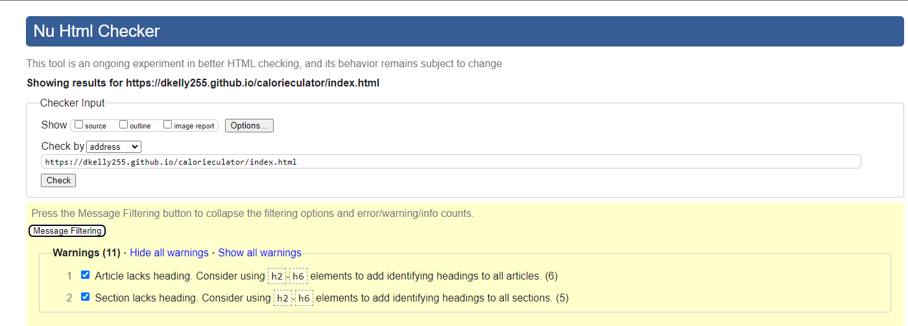

**Calorie Calculation Page:**
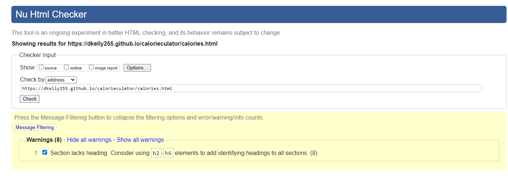

**Macro Mix Page HTML:**
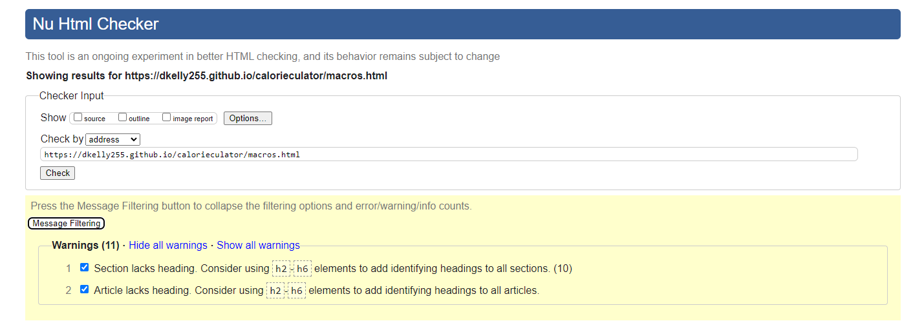

**Meal Planning Page HTML:**
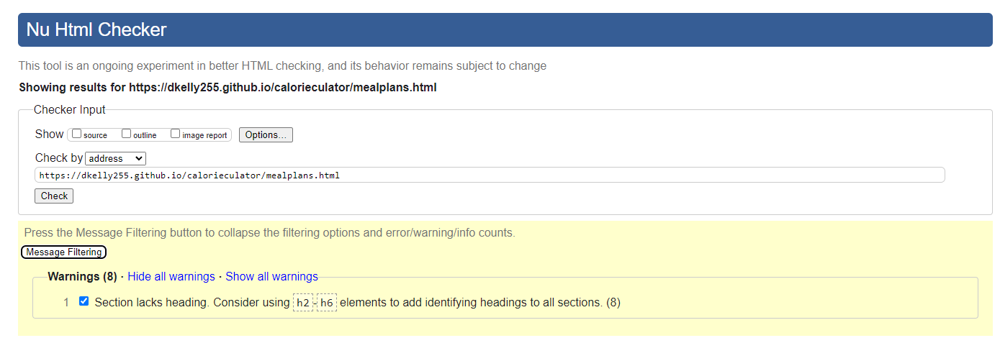

### CSS Testing
- The CSS Jigsaw Validator was used to confirm that the CSS code was error free & functioned as expected.
- As my CSS Code was contained in a single stylesheet (style.css) - I was able to validate the full website's styling via one direct input

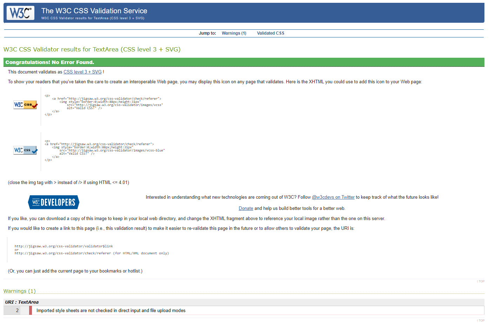

### Javascript Testing

I used the Jshint.com Javascript validation service to validate all of the site's Javascript, and confirmed that no errors or warnings were present per illustrations below:

*script.js - javascript supporting calories.html:*
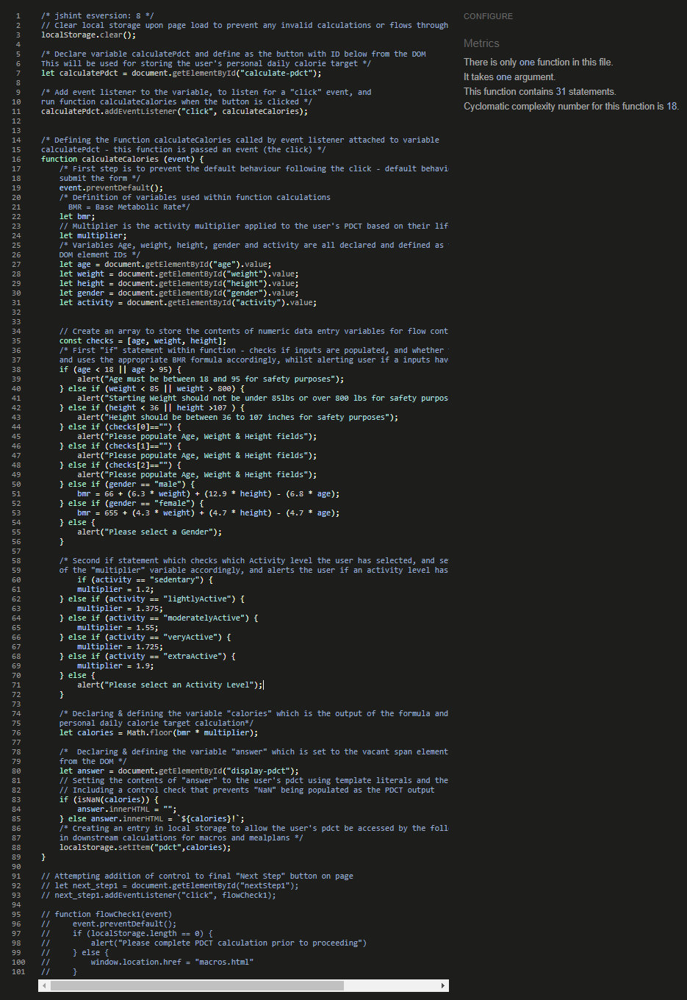
*macros.js - javascript supporting macros.html:*
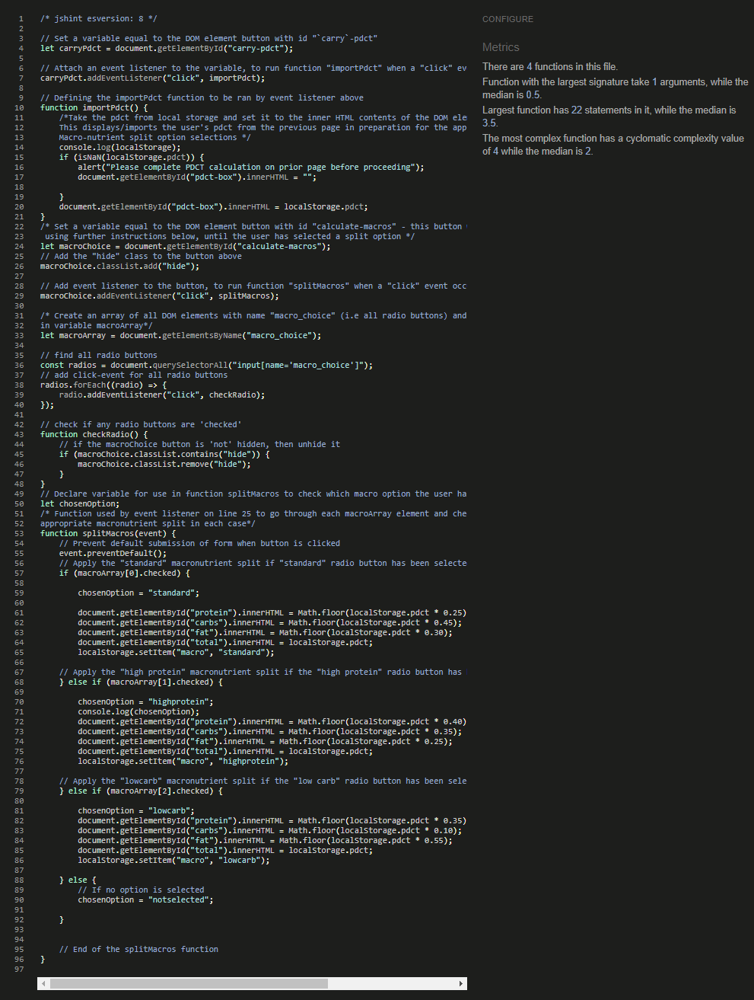
*meals.js - javascript supporting mealplans.html:*
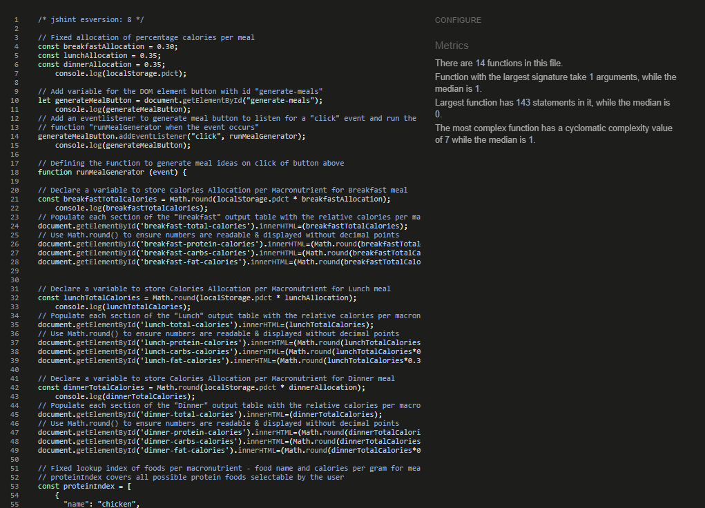

### Accessibility Testing
*Homepage Lighthouse Scores:*
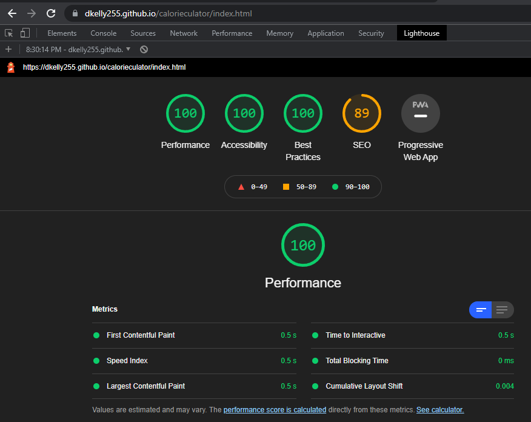

*Calorie Calculation Page Lighthouse Scores:*

*Macro Split Page Lighthouse Scores:*
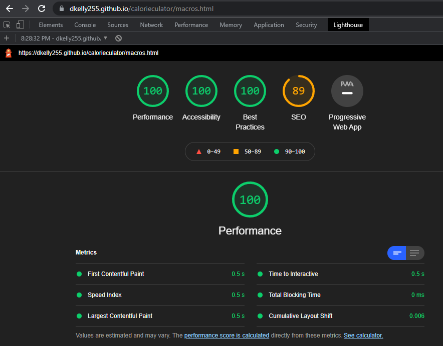

*Meal Generation Page Lighthouse Scores:*
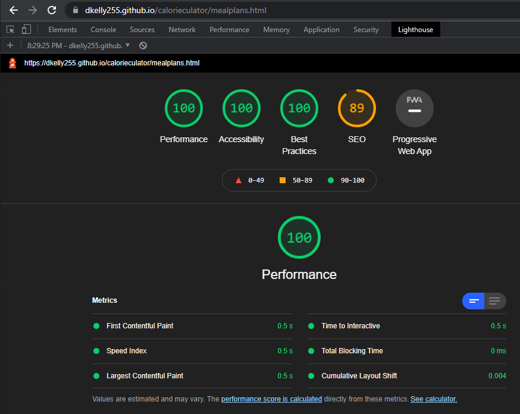

### Resolved Bugs
JS formulas not working on macros.html - needed to add separate .js files for each .html page

### Unresolved Bugs
- No unfixed bugs were present in the finalised website code
## Deployment
- The site was deployed to Github pages. The steps to display are as follows:
    - In the GitHub repository, navigate to the settings tab
    - From the source section drop-down menu, select the master branch
    - The link will then be provided to the completed website

The live link can be found here: [CalorieCulator](https://dkelly255.github.io/calorieculator/)

### Local Deployment

If you would like to make a local copy of this repository, you can clone it by typing the following command in your IDE terminal:
- `git clone https://github.com/dkelly255/calorieculator.git`

Alternatively, if you use Gitpod, you can [click here](https://gitpod.io/#https://github.com/dkelly255/calorieculator) to generate a new workspace using this repository.

## Credits

Nav Bar & Logo - skillthrive [Navbar Tutorial](https://www.youtube.com/watch?v=PwWHL3RyQgk)

Footer credits - https://www.youtube.com/watch?v=zdA3qZNH1vc
### Content

### Media

