# 

## Introduction
- CalorieCulator is a lifestyle improvement site allowing users to calculate a personalised daily calorie target, apply a range of Macronutrient options, and generate sample meal plans
- The site will initially request the user to input several key measurements (height, weight, age etc) - these measurements will then be used by JavaScript to populate a standard formula (BMR) to calculate and return the user's personalised daily calorie target (PDCT)
- The next step is to ask the user to choose their macronutrient goals from a list of three options - when combined with the calorie output from step 1, this will allow Javascript to calculate a simple personalised protein/carb/fat macronutrient split for the user
- Finally the site will show the user a list of common foods per macronutrient category - the user will select/unselect their preferences & the site will use the list to generate simple meal plan ideas that fit within the user's Calorie & Macro calculations, generating combinations of food options from each category's inventory of foods to provide variety 

## User Experience

### **Strategy**
The site strategy is framed around addressing the *User Needs* and **User Stories** below:
- Allow users to learn about why planning & measuring calorie intake can be beneficial for health
- Enable Users to obtain a personalised daily calorie target calculation based on my individual measurements & activity level
- Give Users the ability to calculate individualised macro-nutrient mix calculations based on the individual calorie targets above combined with chosen macro-split options
- Generate meal plan ideas for users based on personalised calorie target & macro mix calculations, and personalised chosen preferred food selections

### **Scope**

The Site Scope is informed by the Strategy above, in terms of the Functional Specifications and Content Requirements of the site - I wanted to ensure optimal scope to actualise the strategy by including content and interactivity that help enable the user stories:
- The site's scope encompasses the informational benefits of choosing to measure and control caloric intake, set against background images to help a user visually internalise aspects of the activity, as well as three interactive pages to allow the user calculate their calorie targets, macronutrient splits, and meal plans
- I have also demarcated the original possible list of site scope into **"existing features"** and **"features yet to implement"** - with the former containing the final features of the live site in the spirit of ensuring a Minimum Viable Product (MVP) that would meet project deadlines

To ensure control of the site scope my overall Project Management approach was to use a constantly evolving personal issue & item [Tracking File](scope_tracker.docx)

This was simply a very basic Microsoft Word document which I kept live and regularly added to/deleted from as the project scope evolved - I found this helped in bringing the project scope through the development process and to identify and avoid issue such as scope creep which may otherwise been detrimental to the User Experience. 

The original document is included in the repository for context, and can be downloaded by [Clicking Here](scope_tracker.docx) 

### **Structure**
The site is structured via a 4 page layout, with a header, navigation bar and footer common to all pages, to help the user traverse the site flow - with access controls around the third and fourth pages, to ensure a user cannot prematurely attempt downstream calculations minimising the potential for errors/logic clashes. The four pages map as follows:

*1. Home Page:* The site's home page will greet the user with an introduction to the "What", "Why", and "How" of calorie planning & measurement. This page will always be available to the user, as it does not contain any calculations but instead is focused on providing an introduction, with background and context to the user in advance of the calculations on the following pages

*2. Calorie Calculation Page:* The Calorie Calculation page will take inputs from the user via HTML data entry fields - including the user's gender, height, weight, age & activity level - allowing Javascript to use these inputs as variables in a pre-determined set of formulas, and returning a personalised calorie target for the user. The Harris-Benedict formula is used for the initial Basal Metabolic Rate (hereafter referred to as "BMR") which is then uplifted by an activity factor according to the user's choice (From 1. Sedentary to 5. Very Active). This page is also always available to the user as it is not dependent on inputs or outputs from any previous pages.

*3. Macro Mix Page:* The Macro Mix page will ask the user to choose their desired macro-nutrient split (Protein/Carbs/Fats) from three pre-defined options (standard, high-protein, and low-carb) and will then combine this specification with the output from the calorie calculation page, and standard estimated calories per macronutrient per gram to arrive at a personalised daily split in grams per macro-nutrient. This page is hidden from the user via javascript functionality until page 2 has been completed, as it is dependent on the output from completion of the calorie calculation on page 2.

*4. Meal Planning Page:* The Meal planning page is the final step in the site flow - and will request the user to select their preferences (or unselect their dislikes) from a pre-determined list of common foods from each of the three macronutrient categories (Protein/Carbohydrates & Fats). This page is also hidden from the user via javascript functionality, as it is also dependent on the output from calculations on pages 2 and 3.

Completion of this activity will trigger Javascript to build the choices into an array per macro group, and then return one random food choice per macro group within boundaries of: 
- (1) Total daily calories are to equal step 1 output (with a possible small error bar +/- tolerance factor for rounding depending on step 3)
- (2) Daily Calories per individual macro group (Protein/Carb/Fat) are to equal step 2's macro split output (subject to rounding/tolerance)
- (3) There must be one food from each macro group per meal 
- (4) There must be three meals per day (Breakfast, Lunch, Dinner)

The final structural element will enable the user to see a display of the generated sample daily meal plan idea on the page for their personal use

### **Skeleton**
To drive the early site interface & navigvation design efforts, I am using wireframes to map flows across HTML, CSS & Javascript - using a combination of Microsoft Excel & Powerpoint as I have experience with both:
- Microsoft Powerpoint - Primarily for mapping the web page HTML/CSS aspects & structure
- Microsoft Excel - Primarily for mapping logic & formulas in detail for Javascript & showing linkages & integration points between Javascript & HTML/CSS

#### *Site Wireframe - Original Skeleton Concept:*

[Click here](calculations_wireframe.xlsx) to view & download original Excel File - snapshot below:

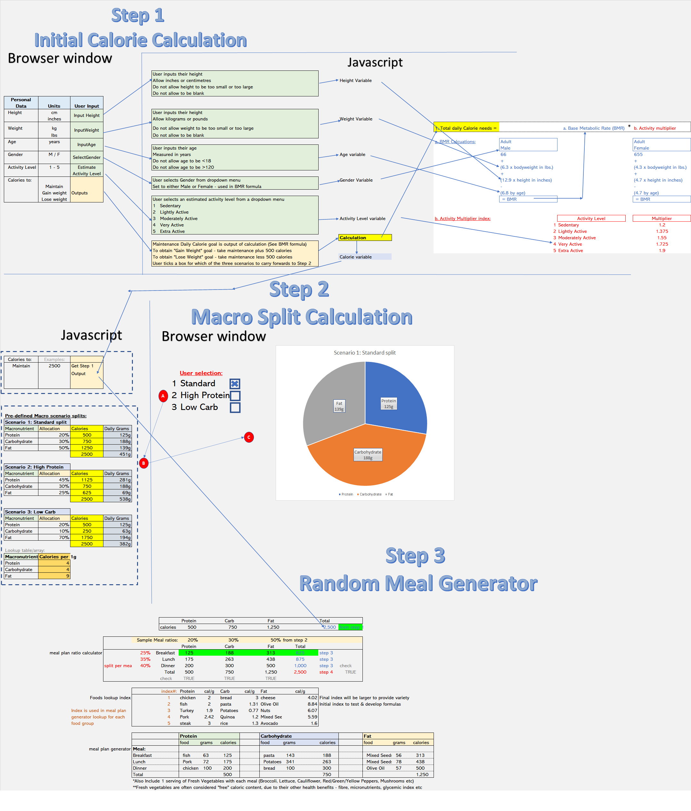

The full original document is also linked above downloadable from the repository should there be a need to dive down further into the detailed formulas & mechanics originally put together as a guide:

*Individual page wireframes*:

[Click here](site_wireframe.pptx) to view & download original Powerpoint File - snapshots below:

*Home Page:*

*Calorie Calculation Page:*

*Macro Mix Page HTML:*

*Meal Planning Page HTML:*

#### *Javascript Skeleton:*

The calculation wireframing allowed me to then carry out a Formula & Function Mapping exercise for Javascript. To arrive at a provisional inventory of the formulas required to enable the site strategy, the original function mapping output was as follows:

A. Calorie Calculation Page
    
    1. Personal Daily Calorie Target (PDCT)

        PDCT = (BMR * Activity Multiplier) * Goal Scenario

    2. Base Metabolic Rate (BMR) 
        
        BMR (Male) = 66 + (6.3 * bodyweight lbs) + (12.9 * height in inches) - (6.8 * age in years)

        BMR (Female) = 655 + (4.3 * bodyweight lbs) + (4.7 * height in inches) - (4.7 * age in years)

    3. Activity Multiplier

        Sedentary = 1.200
        Lightly Active = 1.375
        Moderately Active = 1.550
        Very Active  = 1.725
        Extra Active = 1.900

    4. Goal Scenario

        Maintain Current Weight = 1.0
        Gain Weight = 1.10
        Lose Weight = 0.90

B. Macro Mix Page
    
    5. Option 1: Standard Split

        Protein = PDCT * 20%
        Carbohydrate = PDCT * 50%
        Fat = PDCT * 30%

    6. Option 2: High Protein

        Protein = PDCT * 45%
        Carbohydrate = PDCT * 30%
        Fat = PDCT * 25%

    7. Option 3: High Carbohydrate

        Protein = PDCT * 20%
        Carbohydrate = PDCT * 10%
        Fat = PDCT * 70%

C. Meal Planner Page

    8. Meal Split Ratio - Calories per meal (Static)

        Breakfast = PDCT * 25%
        Lunch = PDCT * 35%
        Dinner = PDCT * 40%

    9. Macros per meal (Dynamic)

        [Meal Split (formula 8)] * [Macronutrient split (from formula 5-7)] in calories per macro per meal
        **Note:** there will be 9x of these calculations - protein, carbs, fat by breakfast, lunch, dinner

    10. Foods Lookup Index (Static)

        Pre-populate with:
        - a fixed index (currently 1 - 5, can be expanded to provide variety)
        - food name (e.g. chicken for protein, rice for carbohydrate, cheese for fat etc)
        - estimated calories per gram (source from internet)

    11. Meal Plan generator

        - An array of (foods) by (meals)
        - Each array element will contain
            - Food name: a random number generated between 1-5 (or length of index in formula 10) and pulled from formula 10's index
            - Meal name: the meal being planned (breakfast, lunch or dinner)
            - Calorie allowance: from formula 9
            - Quantity: of the food (in grams) required to meet the calorie per meal per macro, by dividing formula 9's output by the food's static calories per gram (lookup to formula 10 array)
        - Output will be one food per macronutrient per meal

### **Surface**
The first four Planes of UX enabled the Surface Plane to take shape in terms of finalising the look and feel of the website in terms of color schemes, typography, and imagery:
- #### Color scheme
    - I used the [Coolors](https://coolors.co) color consultation website to generate a [color palette](https://coolors.co/074a88-ffffff-000000) to underpin the content of the site
    - This consists of [Yale Blue](https://coolors.co/074a88-ffffff-000000) (#074A88) and [Black](https://coolors.co/074a88-ffffff-000000) (#000000) backgrounds and highlights behind [White](https://coolors.co/074a88-ffffff-000000) (#FFFFFF) text and borders to ensure sufficient contrast, and that foreground text is never distracted by background imagery

    
- #### Typography
    - I chose the [Montserrat](https://fonts.google.com/specimen/Montserrat?query=montserrat) font to aid readability & help promote a positive emotional response from the external users of the site.  
    

    - I also used [Fontawesome](https://fontawesome.com/) to embed the fire icons,  to help emphasise important elements of the site, and to help with generating a positive emotional response with the site users, and for the favicon image, added to the top of all the site's pages via the head element of the HTML to help with the User Experience & create a professional feel when browsing

- #### Imagery
    - The site is lighter on imagery as it is primarily a calculation engine - however the the hero image is used on all four pages of the site and helps grab the users initial attention before allowing them focus on the content, whilst also being orientated towards the overall site theme of healthy eating. The imagehas a relatively dark background which helps with ensuring a high contrast ratio for the foreground text throughout the site

    

    - At all times I have ensured that foreground information and content is never distracted by this background imagery by using opacity setting on the color palettes. 
    - The imagery is fully detailed in the Credits section, and is primarily sourced from both [Pexels](pexel.com) and [Pixabay](pixabay.com)
        

## Features
### Existing Features

**Header:** 

The header is common to all pages, and contains a simple blue border with white borders consistent with the site's design, against which the CalorieCulator logo is set. The header is positioned to remain visible when scrolling down the page on smaller displays.

**Responsive Navigation Bar:** 

The Nav bar contains links to all four site pages, and contains a highlight to both show the user which page they are currently on, as well as highlighting when the user scrolls over a clickable link. The Nav bar is also fully responsive from ultra-wide down to mobile device screen sizes below 300 pixels in width, and is positioned to disappear off the page when users scroll down, to help maximise screen content on smaller devices.

As detailed in the scope section above, the Nav bar feature also acts as a control over the site flow - using javascript to restrict the user's ability to access downstream calculations without having first completed the pre-requisite site sections. Specifically - via hiding the macro-mix and meal plan pages until the required calorie calculations have been completed by the user

**Footer:** 

The site footer contains the CalorieCulator logo, as well as clickable links to various external Social Media sites where users can connect. The links will always open in a new tab, and the footer is fully resposive using media queries from large screens down to small mobile devices. It contains a combination of Yale blue and black backgrounds, with white text and borders to ensure high contrast ratios and for consistency with the site's design & color scheme.

**Page Titles:** 

Each page contains a header, which either welcomes the user (Home Page) or gives the user direction and instruction on the function of the current page (Calorie Calculation, Macro-Mix, and Meal Plan pages). The Site headers are set against a black background, with white text and white borders to ensure a high contrast ratio, promote consistency in the look & feel of the site across pages, and to help avoid the user becoming disorientated as they anvigate the site flow & functionality. For consistency & readability, the same format is used to display the user's PDCT on the calorie caluclation page and the macro-mix pages.

**Navigation Buttons:** 

The site contains three clickable navigation buttons - a "Begin" button on the home page, a "Next Step" button on the MyCalories page, and a "To Final Step" button on the Macro-Mix page. These buttons are features added to aid the user in traversing the site flow, and are formatted with a grey background and black text to differentiate them from the site headers & content to allow easy navigation of the site for the user.

Similar to the Nav bar feature, the Navigation buttons also act as a controls over the site flow - using javascript to restrict the user's ability to access downstream calculations without having first completed the pre-requisite site sections. 

This is achieved via Javascript event listeners calibrated to unhide the "Next Step" buttons on both the calorie calculation, and macro-mix pages, only when the required click events or local storage entries are present - signifying the availability of the information required for error-free functioning of the downstream pages. 

**Calorie Calculation Form:** 

The Calorie Calculation form takes inputs from the user via HTML data entry fields allowing Javascript to use these inputs as variables in a pre-determined set of formulas, and returning a personalised calorie target for the user. The form is set against a dark background with slight transparency, to ensure foreground text is not distracted by the background imagery, and features three numeric input fields for age, weight & height, as well as two drop down menus for gender and activity level selection. Lastly, the form also contains a calculation button feature, further detailed below

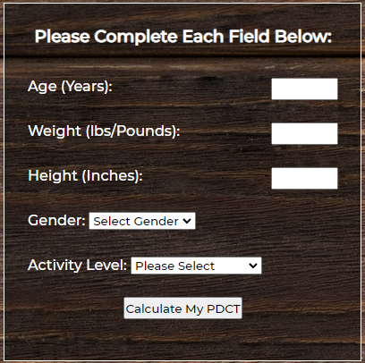

**Data-entry Modals**

To control the data-entry into the calorie calculation form - I have used a combination of Javascript, HTML, and CSS to setup several modals to act as checks, aiding with error prevention and calculation integrity control. 

These modals are configured to appear only when data entry guidelines have been violated, helping to accentuate the user-friendly experience during use of the site. 

The modals will trigger when a field has a numeric value outside a pre-defined range (age, weight or height), has not been selected from a drop-down menu (gender & activity-level), or the field has been left blank (all fields) - thus helping ensure good quality data is input into the javascript calculations.

Age check modal:

Weight check modal:

Height check modal:

Gender check modal:

Activity-Level check modal:
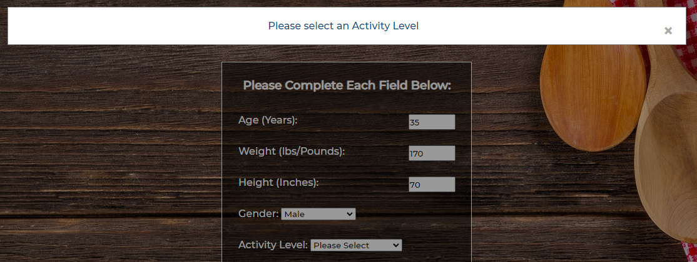

**Calculation Buttons:** 

The site features four calculation/instruction buttons at various points - each of which trigger Javascript to perform certain tasks & interactivity. 

The Calorie Calculation page contains a "Calculate My PDCT" button - triggering the Javascript PDCT calculation function & output storage via an event listener, programmed on script.js.  

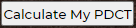

The Macro-mix page contains a "Begin - Import My PDCT" button - triggering Javascript to get the previously calculated PDCT from local storage & display for the user in preparation for the application of the Macronutrient split options to follow

And also contains a button which is programmed to be hidden until the user has selected a Macronutrient split option, when the user has selected an option, Javascript will use CSS attributes & the DOM model to make the button visible & clickable for the user to calculate & display their personal macro split

Lastly, the final calculate button is on the Meal Plan Generator page, where the user can click a button after selecting their desired food choices, to trigger the generation of meal plan ideas. This button is also programmed to be hidden until the user has selected at least one food from each group - to prevent any calculation errors and maintain positive User Experience

**Macronutrient Split Option Display/Selector**

The user is presented with three common macronutrient split options via this feature - it is a table formatted using the site's color palette for consistency, and displays to the user the details of each of the three options, together with a clickable radio button for each option. 

Upon the selection of a split option, a button will appear, allowing the user to click to apply the pre-defined split to their PDCT

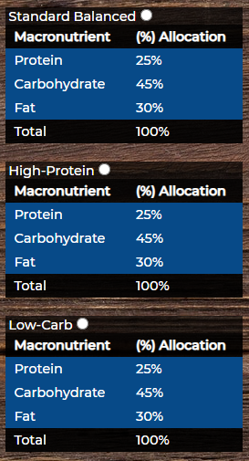

**Personal Macro Calorie Allocation table**

The final feature on the macros page is a table to display the user's PDCT allocated according to their chosen Macronutrient mix. This table is formatted consistently and uses the same color palette as the rest of the site:

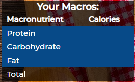

**Food Selection Tables**

This feature allows the user to select/de-select a range of food for inclusion/exclusion from their generated meal plan ideas. The table is structured via three fieldset elements, each with a legend title, and each containing several common sample foods per macronutrient category. 

Each food within each macronutrient category then has a checkbox which allows the user to specifiy their individua personalised choices, to be fed as inputs to the random meal generator, and is controlled by a Javascript function ensuring meal generation cannot be triggered until sufficient food selections have been made by the user:

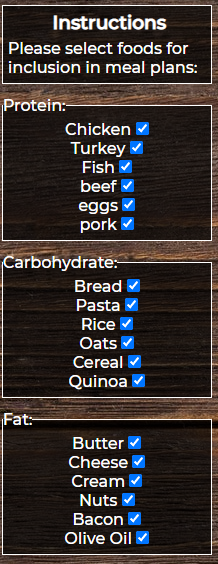

**Meal-Plan Generator Output Display**

The final feature on the meal-generation page is the output display which houses the randomly generated meal plans for each meal. 

The table is formatted consistently with the site's color palette, and with the previous site tables, and displays a breakdown for the user of some meal plan ideas across breakfast, lunch, and dinner, with one food per macronutrient category. 

The meal plan generation is triggered by a button covered in the section above.

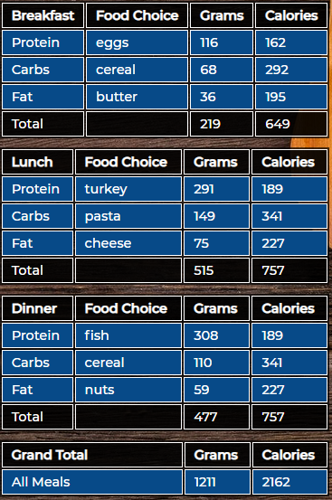

### Features Left to implement:

**Units of measurement - Metric and Imperial** - As illustrated on the overall concept wireframe, originally the intent was to allow multiple units of measurement for the calorie calculation inputs (e.g. height in centimeters, inches, meters or feet etc) depending on the user's preference - however in the interests of meeting project deadlines and avoiding scope creep, I decided to value engineer this feature out of the final product.

**Calorie goal scenario PDCT adjustment:** - Originally it was my intention to include a feature to allow the user to apply a scalar to their PDCT to either lose, gain, or maintain weight. To lose weight, a 10% reduction would be applied to the PDCT, to gain weight, a 10% increase would be applied, and to maintain their current weight, no scalar would be applied. This feature was descoped due to project deadlines.

**Pie Chart for Macronutrient splits** - This feature was intended for the Macro-mix page, to aid with displaying the macronutrient splits graphically in the form of a simple pie-chart with a slice for each macronutrient (Protein/Carbohydrate/Fat). Due to the complexities inherent in adding the graphical piechart, I decided to de-scope this feature, as the site still functions as intended without the pie chart.

**Customisable Meal Calorie Allocations** - This feature would allow the user to select their own customised allocation of calories across each meal - Breakfast, Lunch and Dinner - with the addition of the associated checks & balances to guard data integrity before calculation. However in the interest of project deadlines I decided to limit the meal calorie allocations to static percentages (25% of the PDCT for breakfast, 35% for lunch, and 40% for Dinner) in the Javascript logic, with the percentages fixed at the beginning of the meals.js file.

**Download to CSV:** The final feature left to implement was a "download to CSV" option for the Meal generation page. This feature would have allowed the user to click a button to download a copy of their calorie target, macro splits, and meal plans which they could then save, or print for their own use. However I decided to descope the feature to prioritise other more critical elements of the site's functionality.

## **Testing**

### **Browser Testing**
I completed testing of the website pages in multiple broswers: Chrome, Firefox, Edge, and Safari, and also used DevTools to confirm that the project is responsive, functional and aesthetically pleasing on all standard screen sizes

**Google Chrome:**

**Microsoft Edge:**

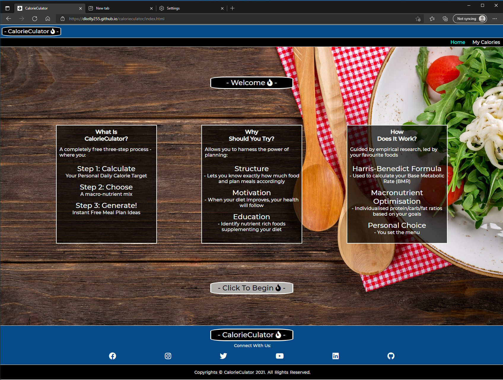

**Firefox:**

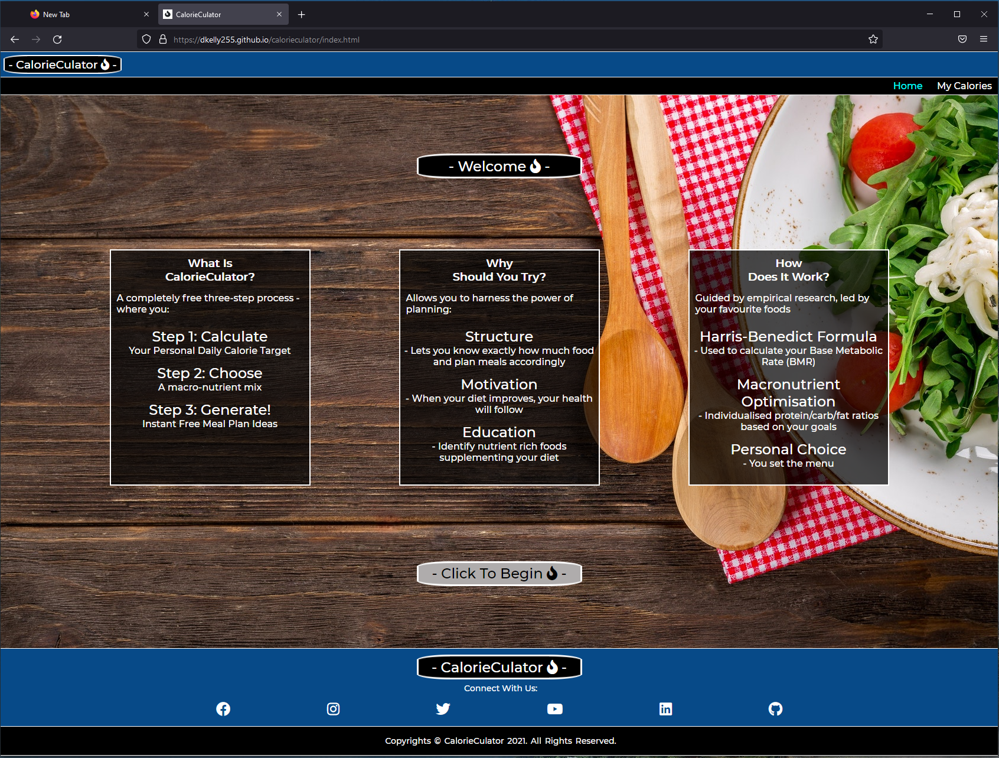

**Safari:**

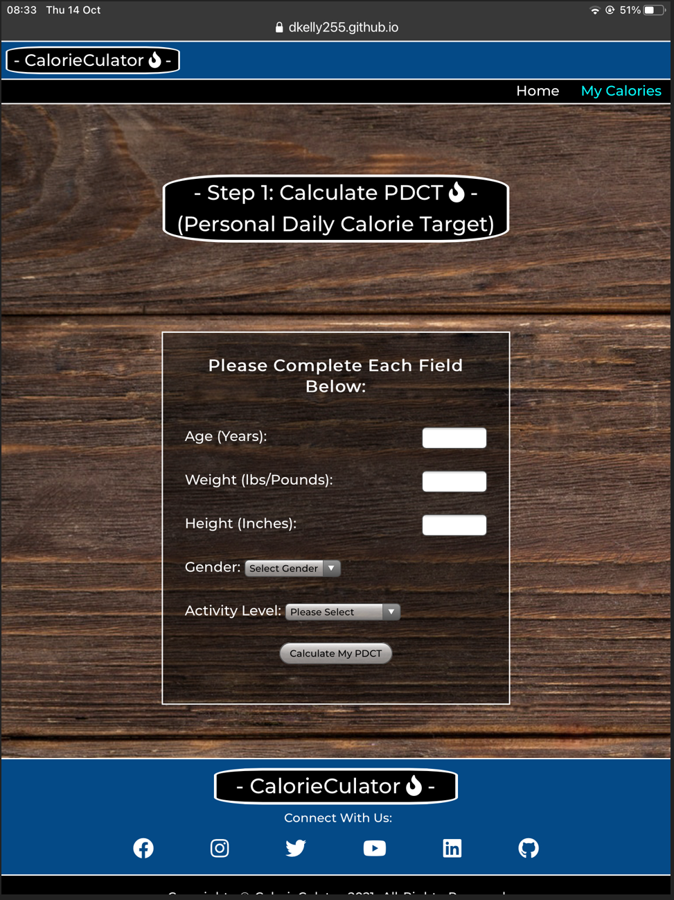

### **Device Testing**
Additionally I tested the site on different devices, operating systems and form factors - physically testing on Desktop (Windows) Ipad Tablet (IOS), and Galaxy Note 10 Phone (Android), and virtually testing multiple form factors via the dev tools auditing suite:

- **Android Galaxy Note 10 (Phone):**

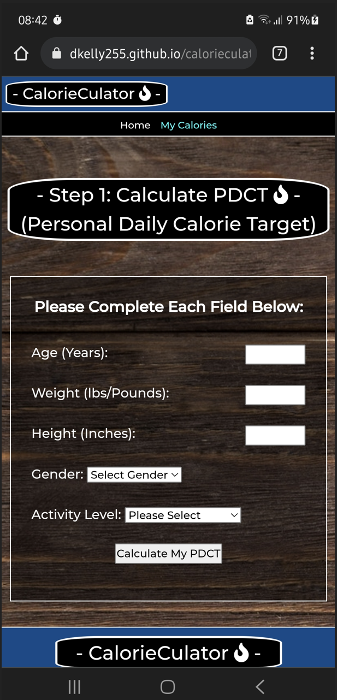

- **Windows 10 (Desktop):**

- **Apple Ipad (Tablet):**

### **HTML Testing**
During the testing phase I used the W3C Validator to confirm that all HTML code was error free & functioned as expected - the only warnings from the validation were related to articles & sections without headings - which are acceptable in this context as they are used in place of divs when working with flex in HTML to optimise the site layout

**Home Page:**

**Calorie Calculation Page:**

**Macro Mix Page HTML:**

**Meal Planning Page HTML:**

### CSS Testing
- The CSS Jigsaw Validator was used to confirm that the CSS code was error free & functioned as expected.
- As my CSS Code was contained in a single stylesheet (style.css) - I was able to validate the full website's styling via one direct input

### Javascript Testing

I used the Jshint.com Javascript validation service to validate all of the site's Javascript, and confirmed that no errors or warnings were present per illustrations below:

*script.js - javascript supporting calories.html:*

*macros.js - javascript supporting macros.html:*

*meals.js - javascript supporting mealplans.html:*

### Accessibility Testing
The DevTools suite, and Lighthouse were used to audit the site's accessibility and found the only accessiblity deficiencies in the site were driven by Search Engine Optimisation 

The **pre-SEO adjusted** Lighthouse scores (with SEO deficiency) are shown below for reference

*Homepage Lighthouse Scores (pre-SEO adjustment):*

*Calorie Calculation Page Lighthouse Scores (pre-SEO adjustment):*

*Macro Split Page Lighthouse Scores (pre-SEO adjustment):*

*Meal Generation Page Lighthouse Scores (pre-SEO adjustment):*

After adding a description and keywords to the Head of each HTML page, the SEO scores were improved to 100%, leaving the final Lighthouse/Accesibilty scores per page below:

*Homepage Lighthouse Scores (post-SEO adjustment):*

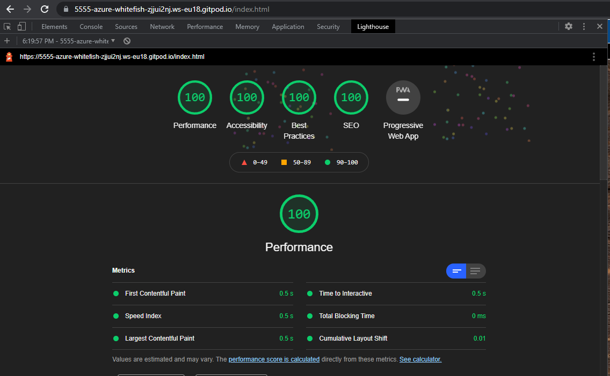

*Calorie Calculation Page Lighthouse Scores (post-SEO adjustment):*

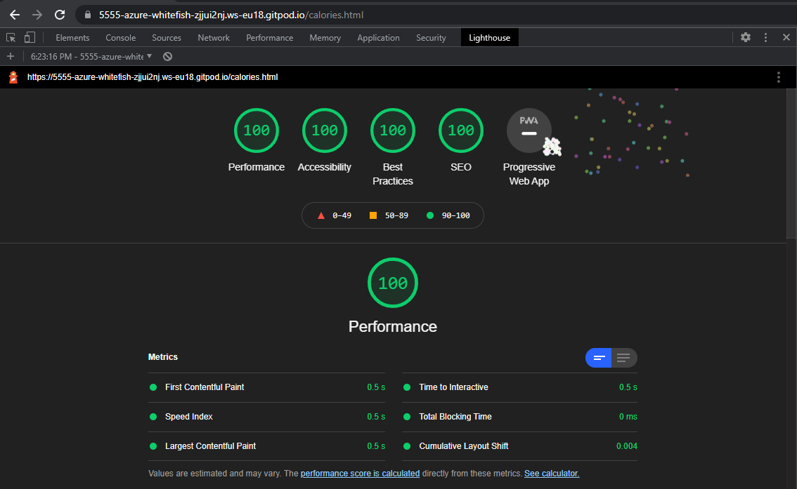

*Macro Split Page Lighthouse Scores (post-SEO adjustment):*

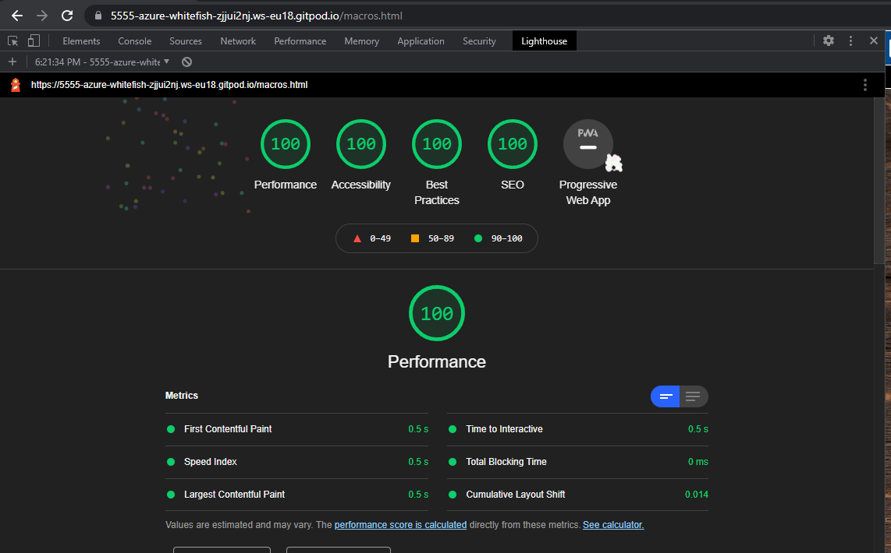

*Meal Generation Page Lighthouse Scores (post-SEO adjustment):*

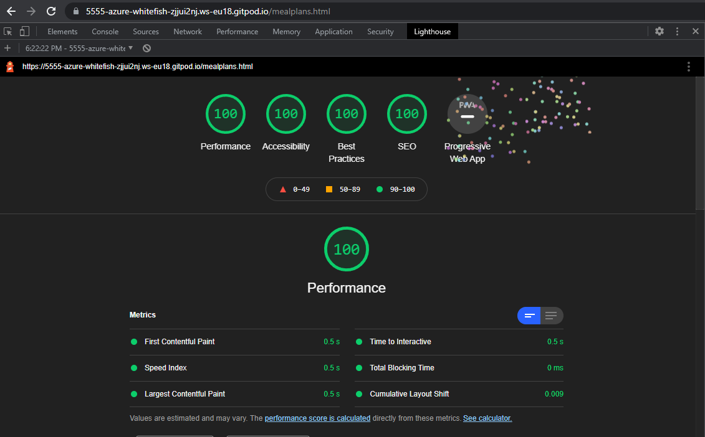

### Resolved Bugs
- Initially I found that my Javascript formulas were not working - however this was simply because I needed to add a script tag with a separate Javascript (.js) files for each HTML page and was easily resolved
- At several stages during design of the site I found javascript formulas were not working as intended, - the most common of which were slight naming differences between javascript variables and their HTML/DOM counterparts (for example uppercase vs lowercase etc), and syntax errors - however through comprehensive debugging I was able to resolve all of these issues 
- Towards the end of development I also found that the Meal Generation code contained a bug which was preventing the last food in the list of each of the three macronutrients from being available to the generator function. This was due to the presence of an unnecessary minus adjustment I was making to the length of the food arrays, which when combined with the Math.Floor() approach, meant that the final food in the list would never be available to the function: 

Protein Bug Example:

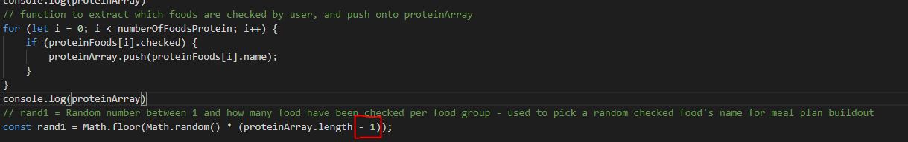

Carbohydrate Bug Example:

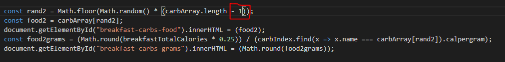

Fat Bug Example:

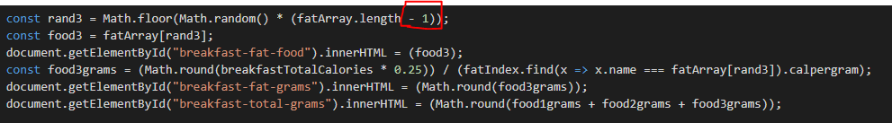

I identified and solved this issue by removing the negative one adjustments from all sections of the function:

### Unresolved Bugs
- No unresolved bugs were present in the finalised website code

## Deployment
- The site was deployed to Github pages. The steps to display are as follows:
    - In the GitHub repository, navigate to the settings tab
    - From the source section drop-down menu, select the master branch
    - The link will then be provided to the completed website

The live link can be found here: [CalorieCulator](https://dkelly255.github.io/calorieculator/)

### Local Deployment

If you would like to make a local copy of this repository, you can clone it by typing the following command in your IDE terminal:
- `git clone https://github.com/dkelly255/calorieculator.git`

Alternatively, if you use Gitpod, you can [click here](https://gitpod.io/#https://github.com/dkelly255/calorieculator) to generate a new workspace using this repository.

## Credits

### Code 
- The Navigation Bar & Logo ideas were apated from ideas in a tutorial from Skillthrive [Navbar Tutorial](https://www.youtube.com/watch?v=PwWHL3RyQgk)
- The Footer was adapted from ideas in a tutorial from Code Opacity [Footer Tutorial](https://www.youtube.com/watch?v=zdA3qZNH1vc)
- The Modal programming was adapted from a W3Schools HowTo on CSS/Javascript Modals [Modals HowTo](https://www.w3schools.com/howto/howto_css_modals.asp)

 ### Content

 - The [Hero Image](https://pixabay.com/photos/salad-food-italian-tasty-wooden-2068220/) was sourced from [Pixabay](https://pixabay.com/photos/salad-food-italian-tasty-wooden-2068220/) and is free for commercial use with no attribution required
 - The [BMR](https://www.medicinenet.com/what_is_the_formula_to_calculate_bmr/article.htm) (Base Metabolic Rate) formulas for both Male & Female were taken from [Medicinenet.com](https://www.medicinenet.com/what_is_the_formula_to_calculate_bmr/article.htm)
 - The [Harris-Benedict equation](https://www.omnicalculator.com/health/bmr-harris-benedict-equation#what-is-the-harris-benedict-equation) was used for the activity level adjustments, and was sourced from [Omnicalculator.com](https://www.omnicalculator.com/health/bmr-harris-benedict-equation#what-is-the-harris-benedict-equation) 
 - The [Macronutrient split options](https://betterme.world/articles/macro-split-for-cutting/) ideas were taken from [betterme.world](https://betterme.world/articles/macro-split-for-cutting/)
 - The [calories per gram estimates](https://www.nhs.uk/live-well/healthy-weight/calorie-checker/) on each food group were taken from [NHS.co.uk](https://www.nhs.uk/live-well/healthy-weight/calorie-checker/)
 - Javascript function checkAllInputs was arrived at via [Stack Overflow](https://stackoverflow.com/) as noted in the javascript comments on meal.js. User [derpischer](https://stackoverflow.com/users/3776927/derpirscher) provided guidance on how to solve my problem of having the meal generation button hidden until selection of at least one of each list of 6x foods per macro group had occured. The link to the original question and answer on Stack Overflow are shown [by clicking here](https://stackoverflow.com/questions/69571703/how-can-i-hide-a-button-until-at-least-three-input-checkboxes-one-from-each-sep) and the comments in meals.js clearly call out the credits for this code adaption being attributed to derpischer & Stack Overflow.

 ### Media
- As per above - The images in the Site were taken from [Pixabay](https://pixabay.com/)
- The site fonts were taken from [Google Fonts](https://fonts.google.com/)
- All Icons, including the Favicon used throughout the site were sourced from [FontAwesome](https://fontawesome.com/)

