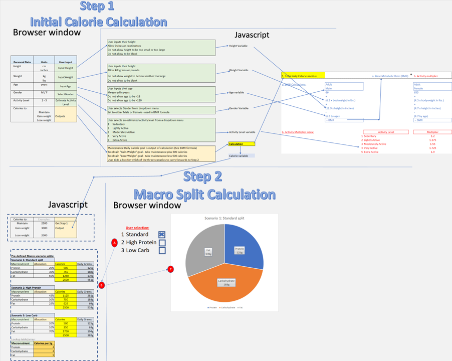

# CalorieCulator - Work In Progress
Note: Provisional content: Under construction & details evolving
## Introduction
- CalorieCulator is a site aimed at people who want to take control of and improve their dietary habits
- The site will initially request the user to input several key measurements (height, weight, age etc) - these measurements will then be used by JavaScript to populate a standard formula (BMR) to calculate and return a personalised daily calorie target
- The next step is to ask the user to choose their macronutrient goals from a list of three options - when combined with the calorie output from step 1, this will allow Javascript to calculate a simple personalised protein/carb/fat macro-nutrient split for the user
- Finally the site will show the user a list of common foods per macro category - the user will select/unselect their preferences & the site will use the list to generate simple meal plan ideas that fit within the user's Calorie & Macro calculations, generating combinations of food options from each category's inventory of foods to provide variety 

## User Experience
### Strategy
- #### User Stories
    - As a user of the site I would like to be able to:
        - Learn about why planning & measuring calorie intake can be beneficial for health
        - Obtain a personalised daily calorie target calculation based on my individual measurements & activity level
        - Receive macro-nutrient mix calculation based on my personalised calorie target above combined with my chosen macro-split option
        - Generate meal plan ideas based on my personal calorie target & macro mix calculations, and my chosen preferred food selections

### Scope
### Structure
The site is delivered via a 4 page structure, with a header, navigation bar and footer common to all pages, to help the user traverse the site flow. The four pages map as follows:

**1. Home Page:** The site's home page will greet the user with an introduction to the "What", "Why", and "How" of calorie planning & measurement. 

**2. Calorie Calculation Page:** The Calorie Calculation page will take inputs from the user via HTML data entry fields - including the user's gender, height, weight, age & activity level - allowing Javascript to use these inputs as variables in a pre-determined set of formulas, and returning a personalised calorie target for the user. 

The Harris-Benedict formula is used for the initial Basal Metabolic Rate (hereafter referred to as "BMR") which is then uplifted by an activity factor according to the user's choice (From 1. Sedentary to 5. Very Active)

**3. Macro Mix Page:** The Macro Mix page will ask the user to choose their desired macro-nutrient split (Protein/Carbs/Fats) from three pre-defined options (standard, high-protein, and low-carb) and will then combine this specification with the below to arrive at a personalised daily split in grams per macro-nutrient

(1) The output from the calorie calculation page

(2) The standard calories per macronutrient gram formula

The Macro Split will be graphically displayed for the user in the form of a pie-chart, and can be used by the site visitor to support their new controlled diet plans

**4. Meal Planning Page:** The Meal planning page is the final step in the site flow - and will request the user to select their preferences (or unselect their dislikes) from a pre-determined list of common foods from each of the three macronutrient categories (Protein/Carbohydrates & Fats). 

Completion of this activity will trigger Javascript to build the choices into an array per macro group, and then  return one food choice per macro group within boundaries of 
- (1) Total daily calories are to equal step 1 output (with a possible small error bar +/- tolerance factor for rounding depending on step 3)
- (2) Daily Calories per individual macro group (Protein/Carb/Fat) are to equal step 2's macro split output (subject to rounding/tolerance)
- (3) There must be one food from each macro group per meal 
- (4) There must be three meals per day (Breakfast, Lunch, Dinner)

The user will then see a display of the generated sample daily meal plan, and can also download a copy for use offline if they wish

### Skeleton
#### Wireframes 
To drive the early site design efforts, I am using wireframes to map flows across HTML, CSS & Javascript - provisionally using a combination of:
- Microsoft Powerpoint - Primarily for mapping the web page HTML/CSS aspects & structure
- Microsoft Excel - Primarily for: 
    1. Mapping logic & formulas in detail for Javascript
    2. Showing linkages & integration points between Javascript & the HTML/CSS)

I have chosen these programs as I have experience with both, and Microsoft excel in particular for setting up formula calculations to guide the Javascript programming efforts

**Initial logic flow/mapping diagram** (Under Construction - full version with Step 3 work in progress as of 21/09)

**Step 3 - Meal Plan Generator logic**

**Home Page:**

**Calorie Calculation Page:**

**Macro Mix Page HTML:**

**Meal Planning Page HTML:**

### Formula Mapping (For Javascript)

An inventory of the formulas required to enable the site strategy are as follows:

A. Calorie Calculation Page
    
    1. Personal Daily Calorie Target (PDCT)

        PDCT = (BMR * Activity Multiplier) * Goal Scenario

    2. Base Metabolic Rate (BMR) 
        
        BMR (Male) = 66 + (6.3 * bodyweight lbs) + (12.9 * height in inches) - (6.8 * age in years)

        BMR (Female) = 655 + (4.3 * bodyweight lbs) + (4.7 * height in inches) - (4.7 * age in years)

    3. Activity Multiplier

        Sedentary = 1.200
        Lightly Active = 1.375
        Moderately Active = 1.550
        Very Active  = 1.725
        Extra Active = 1.900

    4. Goal Scenario

        Maintain Current Weight = 1.0
        Gain Weight = 1.10
        Lose Weight = 0.90

B. Macro Mix Page
    
    5. Option 1: Standard Split

        Protein = PDCT * 20%
        Carbohydrate = PDCT * 50%
        Fat = PDCT * 30%

    6. Option 2: High Protein

        Protein = PDCT * 45%
        Carbohydrate = PDCT * 30%
        Fat = PDCT * 25%

    7. Option 3: High Carbohydrate

        Protein = PDCT * 20%
        Carbohydrate = PDCT * 10%
        Fat = PDCT * 70%

C. Meal Planner Page

    8. Meal Split Ratio - Calories per meal (Static)

        Breakfast = PDCT * 25%
        Lunch = PDCT * 35%
        Dinner = PDCT * 40%

    9. Macros per meal (Dynamic)

        [Meal Split (formula 8)] * [Macronutrient split (from formula 5-7)] in calories per macro per meal
        **Note:** there will be 9x of these calculations - protein, carbs, fat by breakfast, lunch, dinner

    10. Foods Lookup Index (Static)

        Pre-populate with:
        - a fixed index (currently 1 - 5, can be expanded to provide variety)
        - food name (e.g. chicken for protein, rice for carbohydrate, cheese for fat etc)
        - estimated calories per gram (source from internet)

    11. Meal Plan generator

        - An array of (foods) by (meals)
        - Each array element will contain
            - Food name: a random number generated between 1-5 (or length of index in formula 10) and pulled from formula 10's index
            - Meal name: the meal being planned (breakfast, lunch or dinner)
            - Calorie allowance: from formula 9
            - Quantity: the quantity of the food (in grams) required to fulfill the calorie per meal per macro, by dividing formula 9's output by the food's static calories per gram (lookup to formula 10 array)
        - Will output one food per macro per meal, to which a note will add fresh vegetables for micronutrients & extra variety

### Surface
- #### Color scheme
- #### Typography
- #### Imagery

## Features
### Existing Features

**Home Page:** The site's home page will greet the user with an introduction to the "What", "Why", and "How" of calorie planning & measurement. 

**Header:**

**Footer:**

**Calorie Calculation Page:** The Calorie Calculation page will take inputs from the user via HTML data entry fields - including the user's gender, height, weight, age & activity level - allowing Javascript to use these inputs as variables in a pre-determined set of formulas, and returning a personalised calorie target for the user. The Harris-Benedict formula is used for the initial Basal Metabolic Rate (hereafter referred to as "BMR") which is then uplifted by an activity factor according to the user's choice (From 1. Sedentary to 5. Very Active)

**Macro Mix Page:** The Macro Mix page will ask the user to choose their desired macro-nutrient split (Protein/Carbs/Fats) from three pre-defined options (standard, high-protein, and low-carb) and will then combine this specification with (1) the output from the calorie calculation page, and (2) the standard calories per macronutrient gram formula, to arrive at a personalised daily split in grams per macro-nutrient. This will be graphically displayed for the user in the form of a pie-chart, and can be used by the site visitor to calibrate their new controlled diet plans

**Meal Planning Page:** The Meal planning page is the final step in the site flow - and will request the user to select their preferences (or unselect their dislikes) from a pre-determined list of common foods from each of the three macronutrient categories (Protein/Carbohydrates & Fats). 

Completion of this activity will trigger Javascript to build the choices into an array per macro group, and then  return one food choice per macro group within boundaries of 
- (1) Total daily calories are to equal step 1 output (with a possible small error bar +/- tolerance factor for rounding depending on step 3)
- (2) Daily Calories per individual macro group (Protein/Carb/Fat) are to equal step 2's macro split output (subject to rounding/tolerance)
- (3) There must be one food from each macro group per meal 
- (4) There must be three meals per day (Breakfast, Lunch, Dinner)

**Download to CSV:** A feature where the user can click a button to download a copy of their calorie target, macro splits, and meal plans

### Features Left to implement

## Testing
### Generic Testing
- I completed testing of the website pages in multiple broswers: Chrome, Firefox, Edge, and Safari, and also used DevTools to confirm that the project is responsive, functional and aesthetically pleasing on all standard screen sizes
- Additionally I tested the site on different devices, operating systems and form factors - Desktop & Laptop (Windows) Ipad Tablet (IOS), and Galaxy Note 10 Phone (Android)

### HTML Testing
During the testing phase I used the W3C Validator to confirm that all HTML code was error free & functioned as expected

**Home Page:**

**Calorie Calculation Page:**

**Macro Mix Page HTML:**

**Meal Planning Page HTML:**

### CSS Testing
- The CSS Jigsaw Validator was used to confirm that the CSS code was error free & functioned as expected.
- As my CSS Code was contained in a single stylesheet (style.css) - I was able to validate the full website's styling via one direct input
### Javascript Testing
### Accessibility Testing
### Resolved Bugs
### Unresolved Bugs
- No unfixed bugs were present in the finalised website code
## Deployment
- The site was deployed to Github pages. The steps to display are as follows:
    - In the GitHub repository, navigate to the settings tab
    - From the source section drop-down menu, select the master branch
    - The link will then be provided to the completed website

The live link can be found here: [CalorieCulator](https://dkelly255.github.io/calorieculator/)

### Local Deployment

If you would like to make a local copy of this repository, you can clone it by typing the following command in your IDE terminal:
- `git clone https://github.com/dkelly255/calorieculator.git`

Alternatively, if you use Gitpod, you can [click here](https://gitpod.io/#https://github.com/dkelly255/calorieculator) to generate a new workspace using this repository.

## Credits

Nav Bar & Logo - skillthrive [Navbar Tutorial](https://www.youtube.com/watch?v=PwWHL3RyQgk)

### Content

### Media

